# fineprint-finder

*For instructions on setting up the web application, check out the readme in the `backend` and `frontend` folders.*

## Information
This project aims to design and implement a proof of concept AI-powered system for regulatory horizon scanning. The solution will perform identification, analysis, and alerting of regulatory changes, with a single upload of a PDF. This enables compliance teams to respond faster, reduce manual workload, and minimize compliance risks. By leveraging LLMs, the system will improve accuracy, provide actionable insights, and support compliance teams in staying ahead of evolving regulations.

## Usage
### Quick Links
- [Login](#login)
- [Adding a new regulation](#adding-a-new-regulation)
- [Compare new version of regulation](#compare-new-version-of-regulation)
- [View and read notifications](#view-and-read-notifications)
- [View and edit change in version comparison](#view-and-edit-change-in-version-comparison)
- [Filter changes across a regulation version comparison](#filter-changes-across-a-regulation-version-comparison)
- [Filter changes across multiple regulations and export to CSV](#filter-changes-across-multiple-regulations-and-export-to-csv)
- [(Admin) Create user](#admin-create-user)
- [(Admin) Edit details of user](#admin-edit-details-of-user)
- [(Admin) Change password of user](#admin-change-password-of-user)
- [(Admin) Delete user](#admin-delete-user)

### Login
1. Input the username and password in their respective fields and click "Login"

    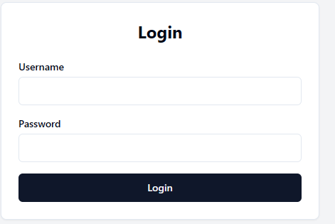

### Adding a new regulation
1. Click the "Dashboard" tab

    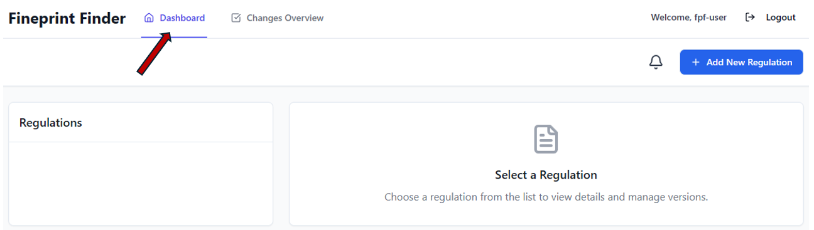
1. Click on "Add New Regulation"

    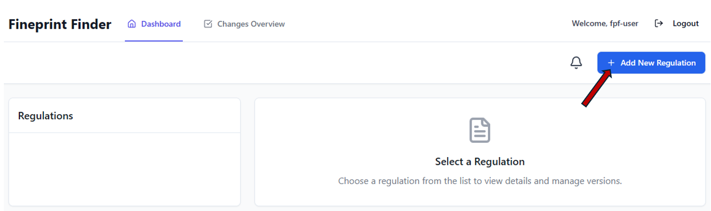
1. Input the regulation title, version title and upload regulation PDF

    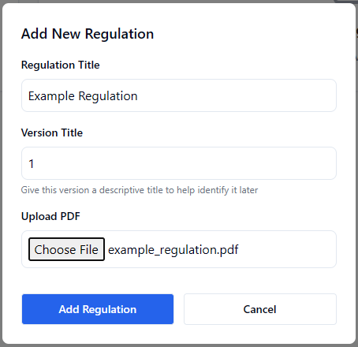
1. Click "Add Regulation"

### Compare new version of regulation
1. Click the "Dashboard" tab

    
1. If previous version of regulation has not been uploaded yet, [upload](#adding-a-new-regulation) it first
1. Locate the regulation you want to compare in the Regulations list and click it

    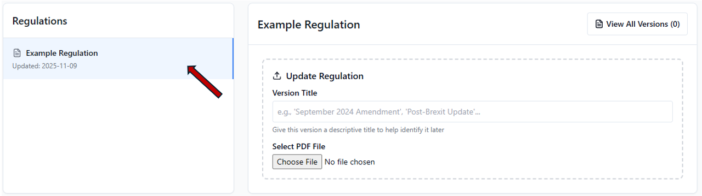
1. Input the version title and upload regulation PDF
1. Click "Upload New Version"
1. Wait for the analysis to complete and do not refresh the page. It will take at least a few minutes

    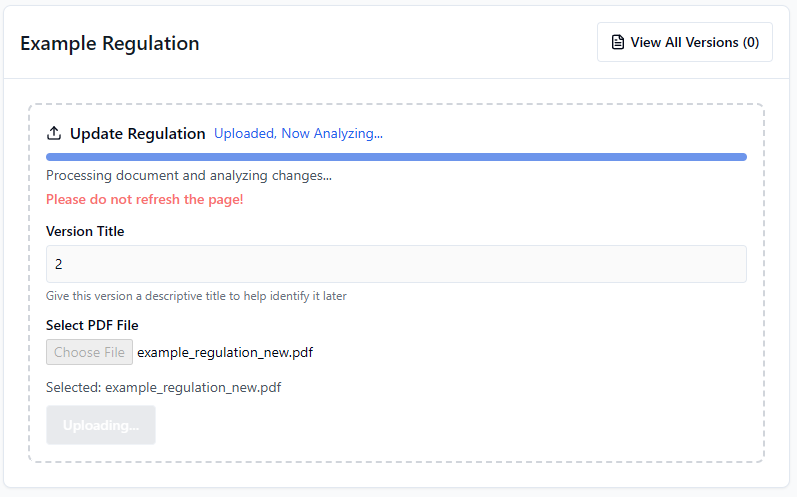

### View and read notifications
1. Click the "Dashboard" tab

    
1. Click the notification icon

    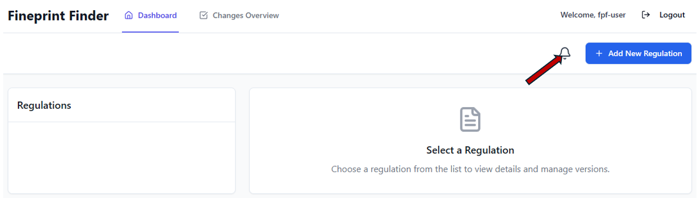
1. If an unread notification exists, click on it to mark it as read

    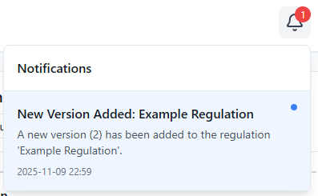

### View and edit change in version comparison
1. Click the "Dashboard" tab

    
1. Locate the regulation you want to view and edit in the Regulations list and click it

    
1. Click the "Compare" dropdown and select preferred version, or click "View All Versions (x)" and click "View" on preferred version

    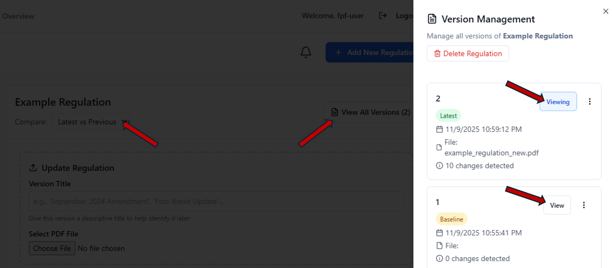
1. Scroll down to "Detailed Changes Analysis"
1. Click toggle arrow on preferred change
1. Click "Edit"

    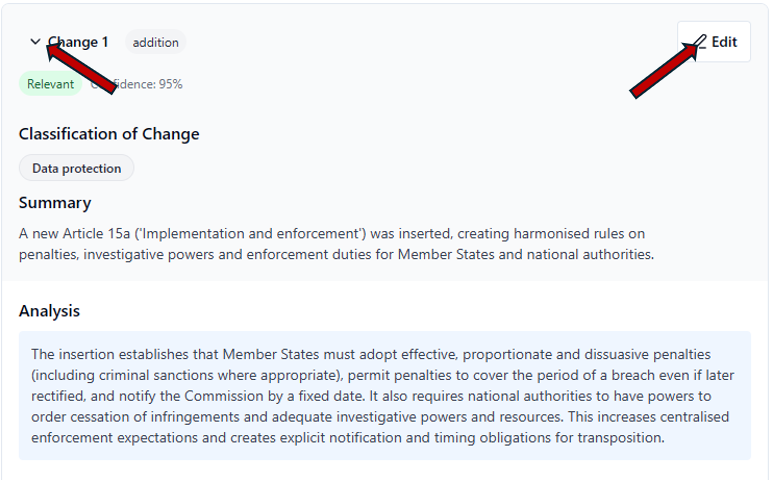
1. Edit preferred field(s). Note: Confidence is the percentage of confidence in accuracy of change, according to the LLM
1. Click "Save"

    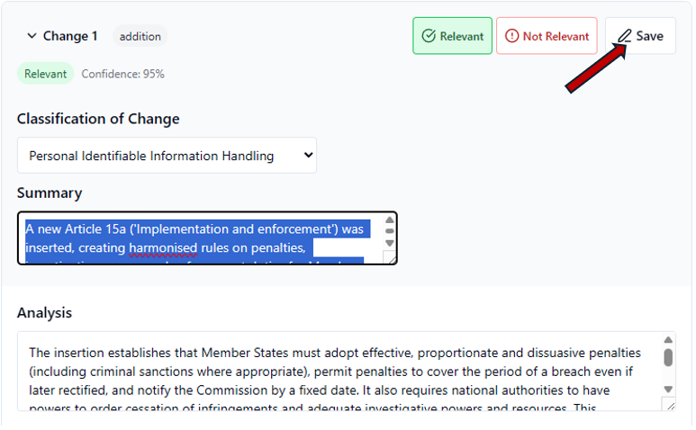

### Filter changes across a regulation version comparison
1. Click the "Dashboard" tab

    
1. Locate the regulation you want to view and edit in the Regulations list and click it

    
1. Click the "Compare" dropdown and select preferred version, or click "View All Versions (x)" and click "View" on preferred version

    
1. Scroll down to "Detailed Changes Analysis"
1. Click "Filter changes" dropdown and select preferred filter

    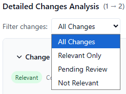

### Filter changes across multiple regulations and export to CSV
1. Click the "Changes Overview" tab

    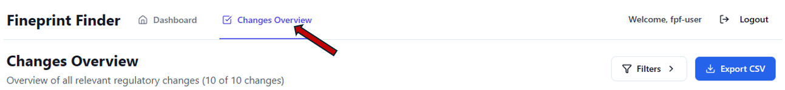
1. Click "Filters" button

    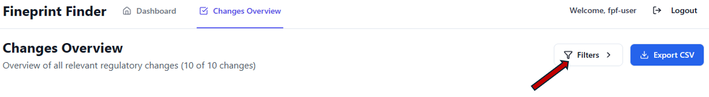
1. Edit preferred filters, results will appear below the filter options
1. Click the "Export CSV" if needed

    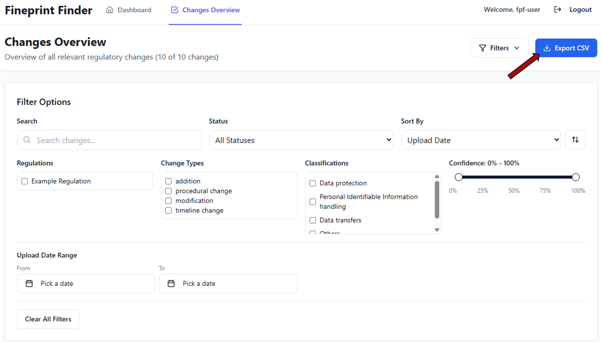

### (Admin) Create user
1. Click the "Admin Panel" tab

    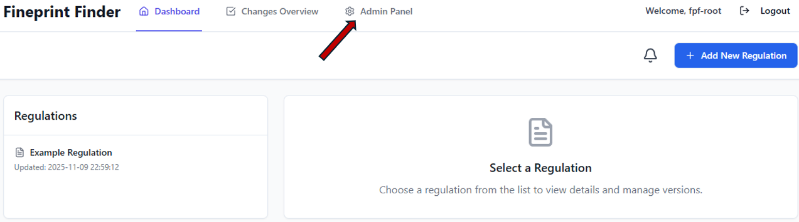
1. Click on "Create User"

    
1. Input details of new user
1. Click "Create User"

    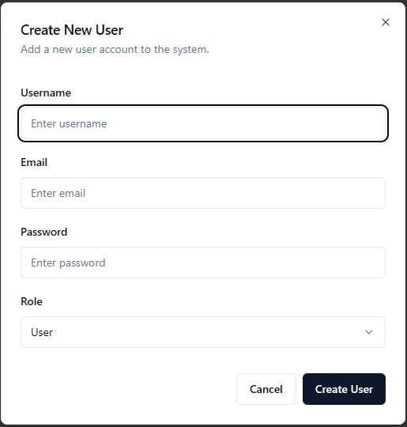

### (Admin) Edit details of user
1. Click the "Admin Panel" tab

    
1. Click the edit icon

    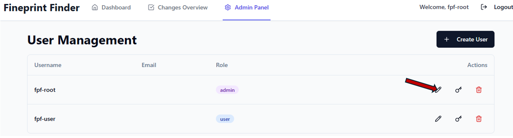
1. Input new details of user
1. Click "Save Changes"

    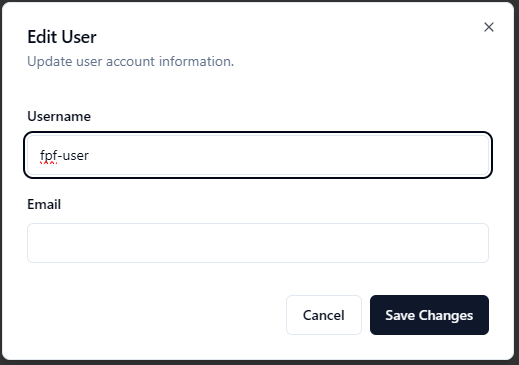

### (Admin) Change password of user
1. Click the "Admin Panel" tab

    
1. Click the password icon

    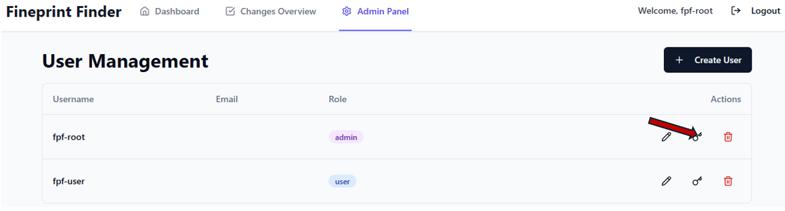
1. Input new password
1. Click "Reset Password"

    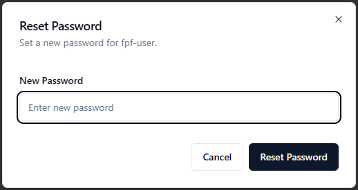

### (Admin) Delete user
1. Click the "Admin Panel" tab

    
1. Click the delete icon

    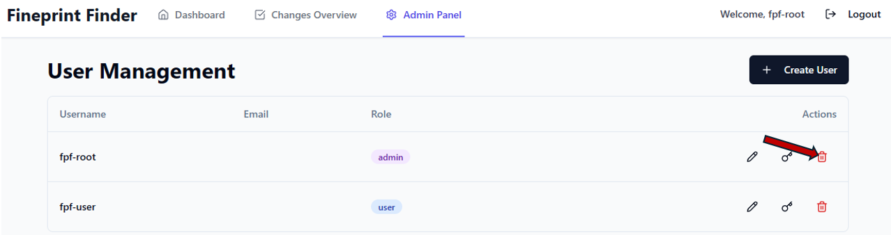
1. Click "Delete User"

    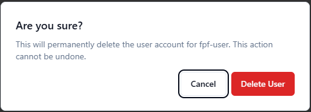
